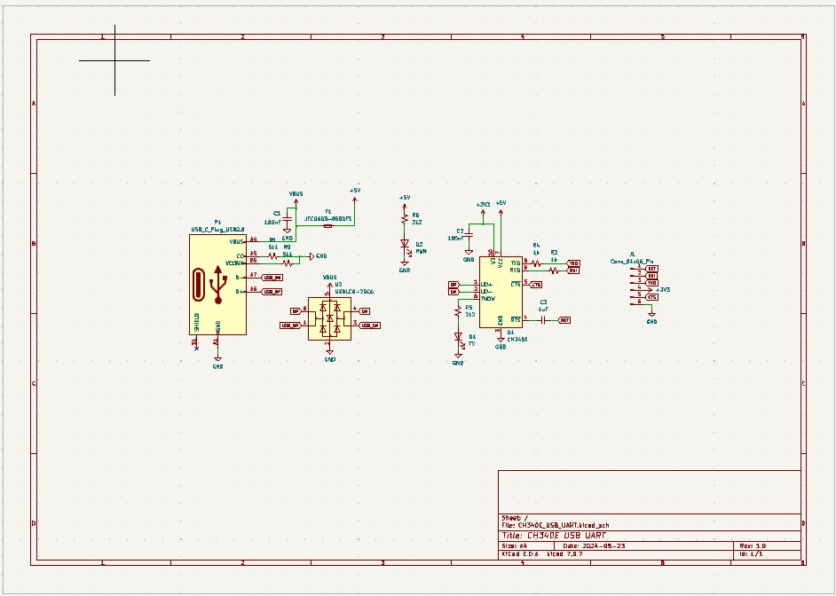
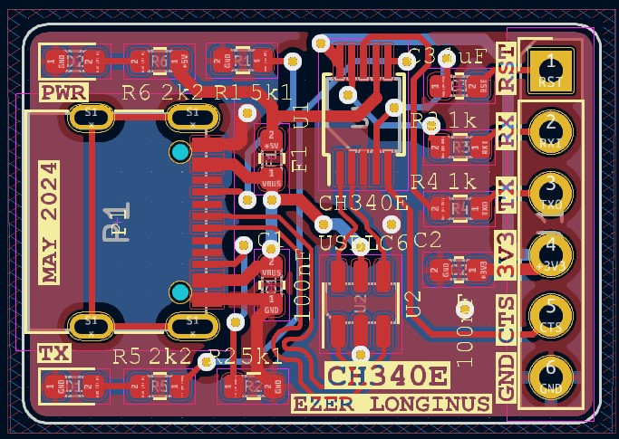
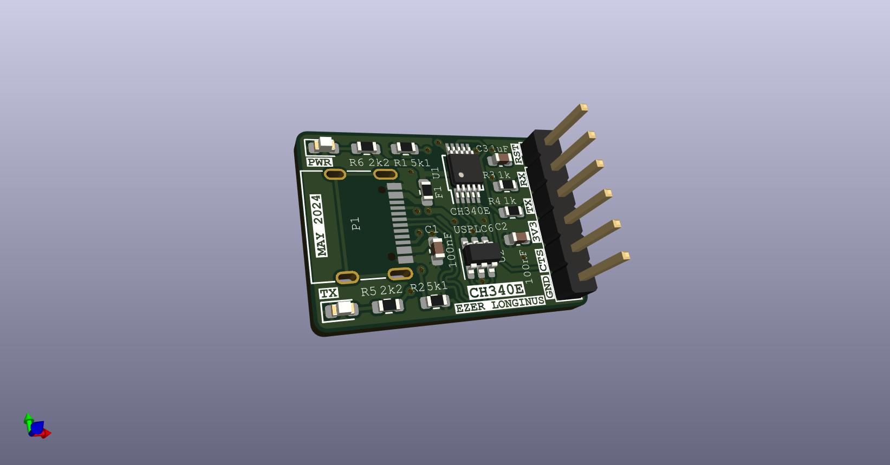

# CH340E_USB_UART
Simple USB to UART adapter using the CH340E

This board is a simple breakout for the CH340E USB to UART interface chip.  This chip is the less expensive option to the CP2102 or FTDI brand chip sets.  

## Purpose
I am looking to incorporate this chip in some designs, and I wanted to make confirm that this design will work.  It's pretty similar to the chips you would see on [AliExpress](https://www.aliexpress.us/item/3256805368897642.html) and [Ebay](https://www.ebay.com/itm/134189916686).

## Scematic

## Layout

## 3D Render

## Current State of Affairs
### Version 1
* Populate and test board
* Fix the inevitable issue that I missed during production

